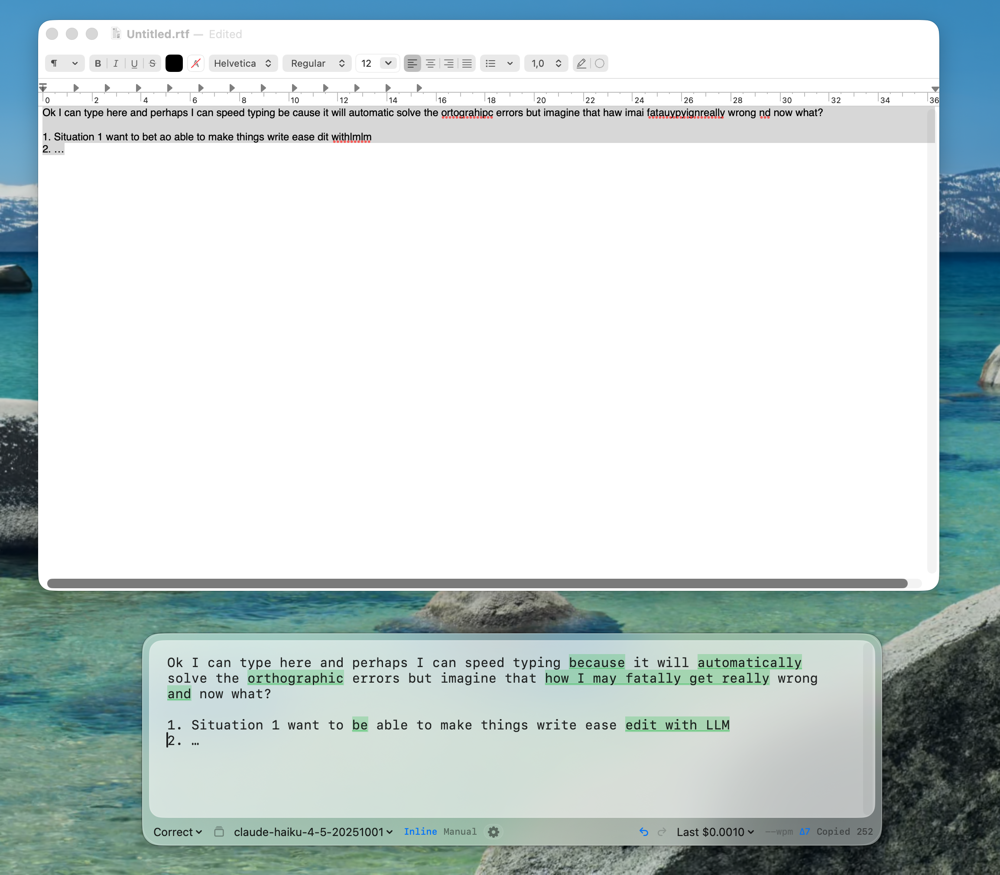

# Retypo Air

Tiny macOS floating textbox. Run saved prompts on selected text (from any app or manual input), auto-copy the result.



> [!IMPORTANT]
> Personal, opinionated, 100% AI-assisted. Use at your own risk.
>
> Built for me: global shortcut, small textbox, snappy nav, saved prompts, clipboard. That's it.
>
> macOS only. No `.app` installer or signing, you run the dev script. Local-first: settings, drafts, history, API keys all live under `~/.retypo-air/`. No telemetry.

## Caveats

- macOS 13+, Swift 5.9+, Xcode CLT or Xcode.
- Selection import (`Cmd+Shift+Space` from another app) needs Accessibility permission. Grant once when prompted; pick `build-dev/RetypoAir-dev.app`.
- BYO API key. One of Groq, Anthropic, OpenAI, OpenRouter.

## Quick start

```bash
cp .env.example .env       # add at least one *_API_KEY. Load order: shell env, .env in CWD, ~/.retypo-air/.env. First wins.
scripts/dev-app.sh         # builds + opens build-dev/RetypoAir-dev.app
```

In Settings, pick a provider and click Refresh to load its models.

## Features

- Multi-provider: Groq, Anthropic, OpenAI, OpenRouter. Models discovered per provider, cached.
- Candidates overlay (`Cmd+D`): mode picker when empty (arrows + Enter run any mode without replacing draft); after `Cmd+Shift+Enter`, browse all-mode outputs side-by-side, Enter applies one.
- Inline diff layout: result replaces input, changed words underlined in subtle green (word-level LCS). Or Stacked: input top, result/diff bottom.
- Themes: Glass (default), Lighter (mostly transparent).
- Optional show-on-active-screen-bottom: `Cmd+Shift+Space` centers panel near cursor's screen.
- Per-mode and per-model shortcuts in Settings.
- History: every run logs input, output, diff, model, prompt, tokens, cost. Limit 10/50/200, restorable.
- Cost tracking: last, session, today USD. Tokens times editable per-model pricing.
- Footer stats: WPM (warm-up + pause-reset), changed-word delta, char count, status.
- Auto-save drafts with realtime recovery + snapshots. Undo/redo (`Cmd+Z`, `Shift+Cmd+Z`).
- Auto-copy on run (toggleable). Optional hide-after-copy.

## Modes (saved prompts)

A mode is a saved system prompt. **Freeform** is special: type the prompt live each run (popup on Enter, type, Enter to apply).

Built-in: Correct, Typos & Grammar, Improve Writing, Translate, Simplify, Summarize, Bullets, Better way of saying, Make this Tweet Fit, Generate 3 variations, How to respond 3 ways, Caveman, **Freeform**.

Edit, rename, disable, shortcut-bind in Settings. Stored in `~/.retypo-air/modes.json`.

## Selection import precedence

When `Cmd+Shift+Space` from another app:

1. **AX selection**. Fast, no clipboard touched. Native macOS apps.
2. **Synthetic `Cmd+C`** via AX-pressed Copy menu. Clipboard read then restored. Terminals, TUIs.
3. **Existing clipboard**. Whatever was already copied.

If a draft already exists, asks before replacing. Failures: `~/.retypo-air/import-debug.log`.

## Keyboard

| Shortcut | Action |
| --- | --- |
| `Cmd+Shift+Space` | Show/hide panel (global). From another app: also imports selection or clipboard |
| `Cmd+Shift+Enter` | Run all enabled modes against current draft |
| `Enter` | Run current mode, auto-copy |
| `Shift+Enter` | New line |
| `Esc` | Hide panel |
| `Cmd+D` | Toggle Candidates overlay |
| `Cmd+S` | Toggle Settings |
| `Ctrl+Tab` | Cycle focus: editor, footer |
| `Tab` / `Shift+Tab` / `Left` / `Right` | Nav within footer, Candidates, Settings |
| `Cmd+1`...`Cmd+0` | Pick a mode (default, editable) |
| `Cmd+Opt+]` / `Cmd+Opt+[` | Cycle accepted models |
| `Cmd+C/V/X/A`, `Cmd+Z`, `Shift+Cmd+Z` | Standard editing |
| `Option+Left/Right`, `Shift+Option+Left/Right` | Move/select by word |
| `Home` / `End` (`Cmd+` for doc) | Line/document boundaries |
| `Ctrl+U` / `Ctrl+K` / `Ctrl+Y` | Kill to line start/end, yank |
| `Cmd+Q` | Quit |

`Cmd+Shift+Space` is not Spotlight (`Cmd+Space`) or emoji viewer (`Ctrl+Cmd+Space`). A few apps may bind it but it's usually safe.

## Files (`~/.retypo-air/`)

| File | Purpose |
| --- | --- |
| `settings.json` | Prefs |
| `modes.json` | Editable modes/prompts |
| `pricing.json` | USD per 1M tokens (editable) |
| `history.json` | Run history (input, output, diff, prompt sent) |
| `usage-ledger.json` | Token/cost ledger |
| `draft.txt` | Realtime draft recovery |
| `draft-history.json` | Draft snapshots |
| `import-debug.log` | Selection-import diagnostics |

## Contribute / quality

Pre-push hook runs `bin/quality`: SwiftLint, Periphery, tests, coverage. All ratcheted from `quality_thresholds.json`. See `QUALITY.md`.

```bash
bin/quality          # run all gates
bin/quality-bump     # ratchet baseline lower after improvements
swift test           # tests only
```
